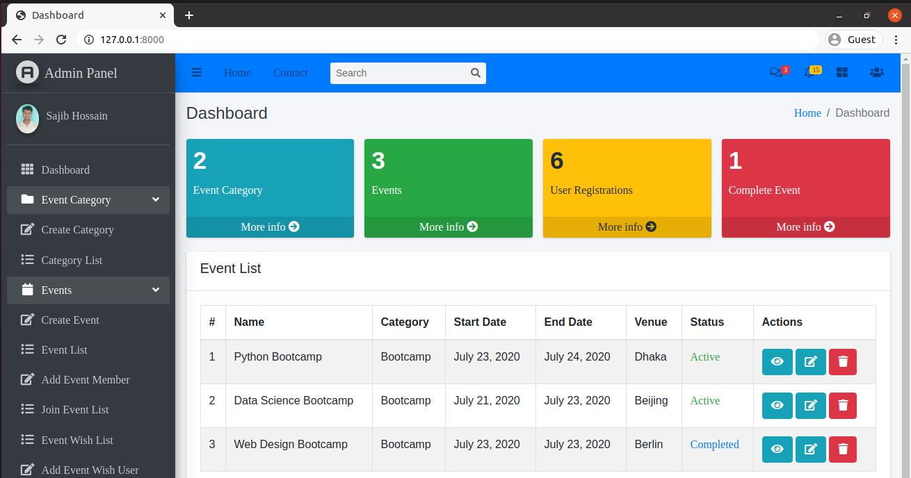

# Event Management System

An Event Management System built with Django and JavaScript, designed to streamline the organization and management of events.

![Dashboard Screenshot] 

## Features

- **Dashboard**: Overview of event categories, events, user registrations, and completed events.
- **Event Categories**: Create, list, and manage event categories.
- **Events**: Create, view, and manage events.
- **User Registrations**: Monitor and manage user registrations for events.
- **Event Status**: Track the status of events (Active, Completed).

## Technologies Used

- **Backend**: Django
- **Frontend**: JavaScript, HTML, CSS, Bootstrap

## Installation and Running this Web-Application

## How To Setup On Linux

1. Clone This Project `https://github.com/MrBytes10/event-management-system-Django-and-Js.git`
2. Go to Project Directory `cd django-event-management`
3. Create a Virtual Environment `python3 -m venv env`
4. Activate Virtual Environment `source env/bin/activate`
5. Install Requirements Package `pip install -r requirements.txt`
6. Migrate Database `python manage.py migrate`
7. Create Super User `python manage.py createsuperuser`
8. Finally Run The Project `python manage.py runserver`

9. Open your browser and go to `http://127.0.0.1:8000`.

## Usage

- **Admin Panel**: Access the admin panel at `http://127.0.0.1:8000/admin` to manage event categories, events, and user registrations.
- **Event List**: View the list of events, including their details such as name, category, dates, venue, and status.

## Contributing

Contributions are welcome! Please open an issue or submit a pull request for any improvements or bug fixes.
